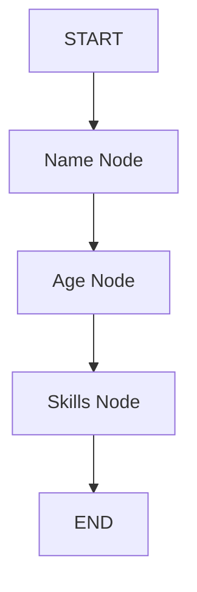
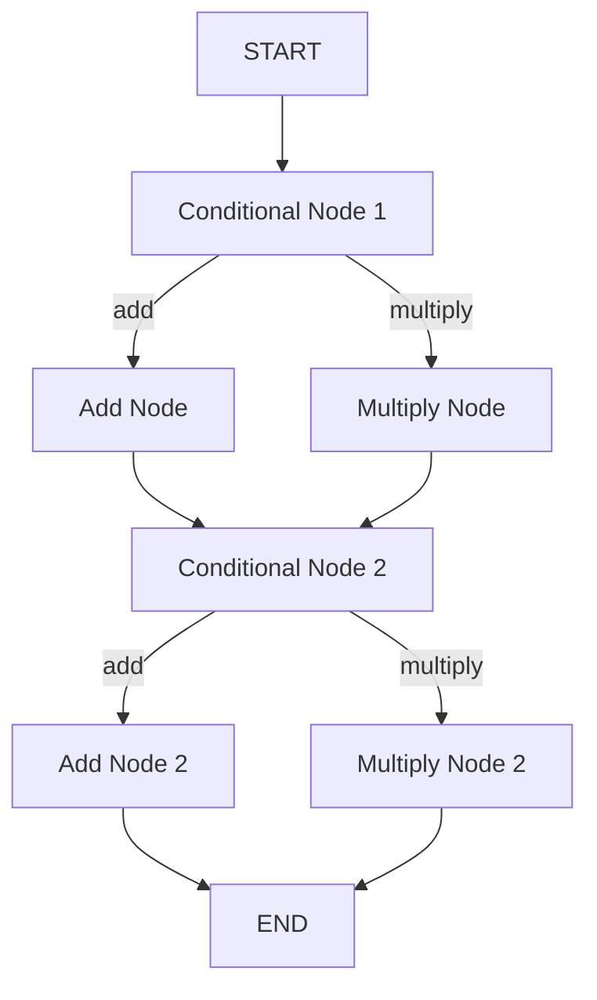

# LangGraphBasic 🚀

[](https://python.org)
[](https://github.com/langchain-ai/langgraph)
[](LICENSE)
[](https://black.readthedocs.io/)

> 🎯 **A comprehensive collection of LangGraph implementations showcasing various graph patterns, from basic greeting bots to complex looping games!**

## 🌟 Repository Highlights

This repository demonstrates the **usage of LangGraph** through practical, well-documented examples that progress from simple to complex graph patterns. Each implementation is ready with comprehensive logging, error handling, and visualization.

### 🔥 You can Find...

- **📊 Visual Graph Representations** - Every graph generates beautiful Mermaid diagrams
- **🔍 Comprehensive Logging** - Production-level logging with detailed debugging
- **🛡️ Robust Error Handling** - Graceful degradation and user-friendly error messages
- **📚 Extensive Documentation** - Every function and class is thoroughly documented
- **🔄 Multiple Graph Patterns** - Sequential, conditional, and looping implementations
- **✨ Clean Code Architecture** - Modular, maintainable, and extensible code

## 🗂️ Project Structure

```
LangGraphBasic/
├── 📁 singel_input_greeting_graph/     # Basic single-node greeting system
├── 📁 multiple_inputs_graph/           # Mathematical operations on lists
├── 📁 sequential_graph/                # Connected nodes processing pipeline
├── 📁 conditional_graph/               # Smart routing based on conditions
├── 📁 looping_graph/                   # Intelligent number guessing game
└── 📄 README.md                        # This awesome documentation!
```

## 🎯 Implementation Showcase

### 1. 🤝 Single Input Greeting Graph
**Perfect for beginners!** A simple greeting system to get your hands dirty.

```python
# Creates personalized greetings
Input: "Alice" → Output: "Hey Alice! How can I help you?"
```

**Features:**
- ✅ Basic LangGraph structure
- ✅ State management fundamentals
- ✅ User input validation
- ✅ Graph visualization

---

### 2. 🧮 Multiple Inputs Mathematical Operations
**Level up with data processing!** Performs operations on number lists.

```python
# Processes lists of numbers
Input: [1,2,3,4], "multiply" → Output: "Product is 24"
```

**Features:**
- ✅ List processing capabilities
- ✅ Dynamic operation selection
- ✅ Input validation and parsing
- ✅ Error handling for edge cases

---

### 3. 🔗 Sequential Graph Processing Pipeline
**Master connected workflows!** Processes user profiles through connected nodes.

```python
# Sequential pipeline processing
Name → Age → Skills → Complete Profile
```

**Features:**
- ✅ Multi-node sequential processing
- ✅ State accumulation across nodes
- ✅ Pipeline architecture
- ✅ Comprehensive profile generation

---

### 4. 🔀 Conditional Graph Smart Routing
**Implement intelligent decision making!** Routes different operations based on conditions.

```python
# Smart conditional routing
Pair1: (5,3) + add → Result1: 8
Pair2: (7,2) + multiply → Result2: 14
```

**Features:**
- ✅ Conditional edge routing
- ✅ Multi-phase processing
- ✅ Parallel operation handling
- ✅ Complex state management

---

### 5. 🎮 Looping Graph Number Guessing Game
**The crown jewel!** An intelligent AI that learns and adapts through gameplay.

```python
# AI learns through feedback loops
AI: "Is it 50?" → User: "Higher" → AI: "Is it 75?" → User: "Lower" → ...
```

**Features:**
- ✅ **Smart Binary Search Algorithm** - Efficient guessing strategy
- ✅ **Dynamic Loop Control** - Continues until win/loss conditions
- ✅ **Adaptive Learning** - Adjusts strategy based on feedback
- ✅ **Game State Management** - Tracks attempts, bounds, and history
- ✅ **Interactive Gameplay** - Real-time user interaction
- ✅ **Performance Analytics** - Tracks efficiency and statistics

## 🚀 Quick Start

### Prerequisites
```bash
Python 3.13+
pip install langgraph IPython
```

### 🏃‍♂️ Run Any Example
```bash
# Navigate to any graph directory
cd looping_graph/

# Run the interactive demo
python main.py
```

### 🎯 Example: Number Guessing Game
```bash
cd looping_graph/
python main.py

# Output:
🎮 WELCOME TO THE AI NUMBER GUESSING GAME! 🎮
🎯 Think of a number between 1 and 20
🤖 I'll try to guess it using smart strategies
```

## 📊 Visual Graph Examples

Each implementation generates beautiful graph visualizations:

### Sequential Graph Visualization


### Conditional Graph Visualization


### 🔧 Code Quality Features
- **Type Hints** - Complete type annotations for better IDE support
- **Docstrings** - Google-style documentation for all functions
- **Error Handling** - Comprehensive exception management
- **Logging** - Multi-level logging with file and console output
- **Validation** - Input validation with user-friendly feedback

### 📈 Performance Optimizations
- **Efficient Algorithms** - Binary search for guessing games
- **Memory Management** - Proper state cleanup and management
- **Resource Handling** - File I/O with proper context management

## 🎓 Path You May Took...

**just follow below parts in order**

1. **Start with** `singel_input_greeting_graph/` - Learn LangGraph basics
2. **Progress to** `multiple_inputs_graph/` - Handle complex inputs
3. **Master** `sequential_graph/` - Understand node connections
4. **Implement** `conditional_graph/` - Add decision-making logic
5. **Challenge yourself** with `looping_graph/` - Build adaptive systems


## 📜 License

This project is licensed under the MIT License - see the [LICENSE](LICENSE) file for details.

## 🙏 Acknowledgments

- **LangGraph Team** - For creating this amazing framework
- **Python Community** - For the excellent ecosystem
- **Contributors** - Everyone who helps make this repository better

## 📞 Connect & Support

- **⭐ Star** this repository if you find it helpful!
- **🐛 Report Issues** - Help us improve by reporting bugs
- **💡 Feature Requests** - Suggest new examples or improvements
- **📧 Questions** - Open discussions for help and ideas

---

**Happy Coding! 🚀✨**
